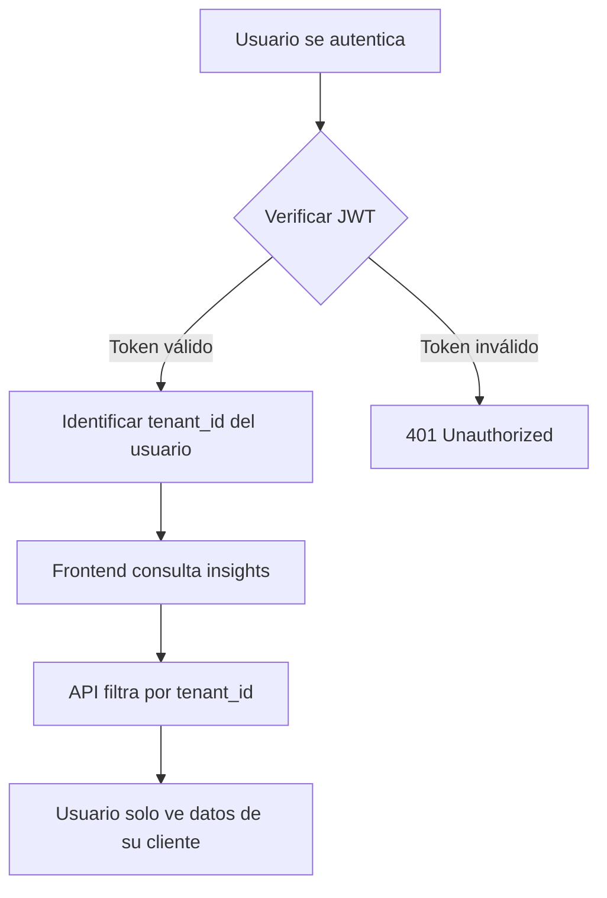
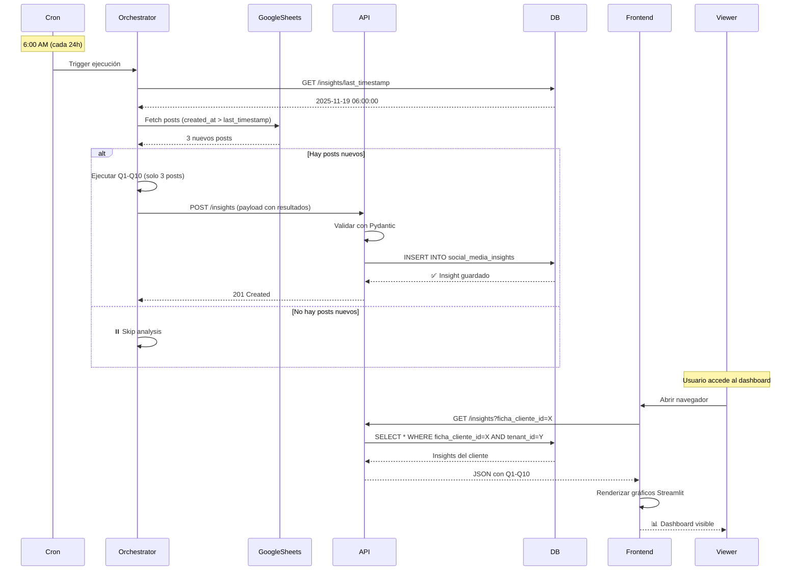

# Especificaciones del Sistema Pixely Partners

## 📋 Documento de Especificaciones Críticas

**Fecha:** 20 de Noviembre, 2025  
**Versión:** 1.0  
**Estado:** Definido y Confirmado

---

## 🎯 1. MODELO MULTITENANT

### 1.1 Arquitectura de Acceso

**Especificación:**
```
1 Análisis = 1 Cliente (Ficha Cliente) = 1 o Más Cuentas de Acceso
```

**Definición de Roles:**

| Rol | Capacidades | Restricciones |
|-----|-------------|---------------|
| **Admin** | - Crear fichas de clientes<br>- Crear usuarios<br>- Ejecutar análisis<br>- Visualizar todos los datos | - Acceso completo al sistema |
| **Viewer (Cliente)** | - Visualizar resultados del frontend<br>- Consultar insights de su ficha<br>- Exportar reportes | - ❌ No puede ejecutar análisis<br>- ❌ No puede modificar datos<br>- ❌ No tiene acceso a otros clientes |

### 1.2 Flujo de Acceso Multitenant



**Implementación Actual:**

1. **Base de Datos (`api/models.py`):**
   - Modelo `Tenant` como raíz jerárquica
   - Modelo `User` con FK a `tenant_id` y campo `role` (admin/user)
   - Modelo `FichaCliente` con FK a `tenant_id`
   - Todos los insights filtrados por `ficha_cliente_id` → `tenant_id`

2. **Autenticación (`api/security.py`):**
   - JWT incluye `sub` (email del usuario) y `tenant_id`
   - Endpoint `/users/me` retorna `tenant_id` del usuario autenticado

3. **Frontend (`frontend/app.py`):**
   - ✅ Solo visualización (Streamlit read-only)
   - ❌ No hay botones de "Ejecutar Análisis"
   - ❌ No hay formularios de ingesta
   - ✅ Todos los datos vienen de API GET endpoints

**Principio de Seguridad:**
> "El frontend es una ventana de solo lectura. La ejecución y modificación de datos es exclusiva del Orquestador automático y del admin vía API."

---

## ⏰ 2. EJECUCIÓN AUTOMÁTICA DEL ORCHESTRATOR

### 2.1 Programación Temporal

**Especificación:**
```
Frecuencia: Cada 24 horas
Horario: Configurable (ejemplo: 6:00 AM)
Método: Cron job en contenedor orchestrator
```

**Implementación:**

```dockerfile
# Dockerfile.orchestrator (líneas relevantes)
RUN apk add --no-cache dcron

# Crontab entry (ejemplo)
0 6 * * * cd /app && python -m orchestrator >> /app/orchestrator/outputs/orchestrator_debug.log 2>&1
```

### 2.2 Lógica de Detección de Nuevos Datos

**Flujo de Decisión:**

```python
# Pseudocódigo del orchestrator/__main__.py

async def main():
    # 1. Obtener última fecha de análisis
    last_analysis_date = await get_last_analysis_timestamp(ficha_cliente_id)
    
    # 2. Consultar Google Sheets del cliente
    new_posts = await fetch_google_sheets_posts(spreadsheet_id)
    
    # 3. Filtrar posts nuevos
    posts_to_analyze = [
        post for post in new_posts 
        if post['created_at'] > last_analysis_date
    ]
    
    # 4. Decisión crítica
    if len(posts_to_analyze) == 0:
        logger.info(f"No new posts found for client {ficha_cliente_id}. Skipping analysis.")
        return  # ⏸️ Termina sin ejecutar Q1-Q10
    
    # 5. Análisis incremental
    logger.info(f"Found {len(posts_to_analyze)} new posts. Starting analysis...")
    
    # 6. Ejecutar solo sobre datos nuevos
    for module in [Q1, Q2, Q3, Q4, Q5, Q6, Q7, Q8, Q9, Q10]:
        result = await module.analyze(posts_to_analyze)
        await save_to_database(result, mode="append")  # Agregar, no reemplazar
```

**Características Clave:**

| Característica | Descripción |
|----------------|-------------|
| **Detección Inteligente** | Compara `created_at` de posts vs `last_analysis_timestamp` |
| **Análisis Incremental** | Solo procesa posts nuevos, no reanaliza histórico |
| **Persistencia Acumulativa** | Los insights nuevos se **agregan** a la data existente |
| **Eficiencia de Costos** | ❌ No hace llamadas a OpenAI si no hay datos nuevos |
| **Actualización del Timestamp** | Registra `last_analysis_timestamp` después de cada ejecución exitosa |

### 2.3 Fuente de Datos: Google Sheets

**Estructura Esperada:**

```
Spreadsheet ID: <configurado en .env por cliente>
Hoja: "Posts"

Columnas obligatorias:
- post_url (String, único)
- platform (instagram|tiktok|facebook)
- created_at (Timestamp ISO 8601)
- content (Text)
- likes (Integer)
- comments_count (Integer)
- shares (Integer)
- views (Integer, opcional)

Hoja: "Comments"

Columnas obligatorias:
- post_url (FK a Posts.post_url)
- comment_text (Text)
- ownerUsername (String)
- created_at (Timestamp ISO 8601)
```

**Integración:**

```python
# orchestrator/ingest_utils.py (conceptual)

import gspread
from oauth2client.service_account import ServiceAccountCredentials

async def fetch_google_sheets_posts(spreadsheet_id: str) -> List[Dict]:
    scope = ['https://spreadsheets.google.com/feeds']
    creds = ServiceAccountCredentials.from_json_keyfile_name('credentials.json', scope)
    client = gspread.authorize(creds)
    
    sheet = client.open_by_key(spreadsheet_id).worksheet("Posts")
    posts = sheet.get_all_records()
    
    return posts
```

### 2.4 Estrategia de Datos Históricos

**Pregunta:** ¿Qué pasa con los insights anteriores cuando llegan posts nuevos?

**Respuesta:**

```sql
-- Estructura de social_media_insights

CREATE TABLE social_media_insights (
    id UUID PRIMARY KEY,
    ficha_cliente_id UUID REFERENCES fichas_cliente(id),
    analysis_timestamp TIMESTAMP,  -- Fecha de esta ejecución del orchestrator
    q1_result JSONB,                -- Resultado de Q1 (solo posts nuevos)
    q2_result JSONB,
    ...
    q10_result JSONB
);
```

**Modos de Persistencia:**

| Estrategia | Descripción | Ventajas | Desventajas |
|------------|-------------|----------|-------------|
| **Append (Recomendado)** | Cada ejecución crea un nuevo registro `SocialMediaInsight` | - Histórico completo preservado<br>- Auditoría temporal<br>- Rollback posible | - Tabla crece linealmente |
| **Update** | Actualiza el registro existente, agregando nuevos posts a los arrays JSON | - 1 solo registro por cliente<br>- Queries más simples | - ❌ Pérdida de historial<br>- ❌ No auditable |

**Decisión de Arquitectura:**

✅ **Modo APPEND con ventana temporal en frontend**

```python
# API endpoint para obtener insights

@app.get("/insights")
async def get_insights(
    ficha_cliente_id: str,
    start_date: Optional[datetime] = None,
    end_date: Optional[datetime] = None
):
    query = db.query(SocialMediaInsight).filter(
        SocialMediaInsight.ficha_cliente_id == ficha_cliente_id
    )
    
    if start_date:
        query = query.filter(SocialMediaInsight.analysis_timestamp >= start_date)
    
    if end_date:
        query = query.filter(SocialMediaInsight.analysis_timestamp <= end_date)
    
    # Frontend puede mostrar "Últimos 30 días" o "Todo el histórico"
    return query.order_by(SocialMediaInsight.analysis_timestamp.desc()).all()
```

---

## 🔐 3. SEPARACIÓN DE RESPONSABILIDADES

### 3.1 Matriz de Capacidades

| Componente | Puede Ejecutar Análisis | Puede Modificar BD | Puede Visualizar |
|------------|------------------------|-------------------|------------------|
| **Orchestrator** | ✅ Automático cada 24h | ✅ Vía API (POST /insights) | ❌ No |
| **API** | ❌ No | ✅ Maneja CRUD y validación | ❌ No |
| **Frontend** | ❌ No | ❌ No | ✅ Solo lectura |
| **Admin (vía API)** | ✅ Manual (opcional) | ✅ Puede forzar análisis | ✅ Vía Adminer o endpoints |
| **Viewer (Frontend)** | ❌ No | ❌ No | ✅ Solo su tenant |

### 3.2 Flujo de Datos Completo



---

## 🎨 4. IMPLICACIONES DE DISEÑO PARA FRONTEND

### 4.1 Restricciones de UI

**Lo que NO debe existir en el frontend:**

❌ Botón "Ejecutar Análisis"  
❌ Formulario "Subir Datos"  
❌ Input "Agregar Publicación"  
❌ Selector "Forzar Re-análisis"  

**Lo que SÍ debe existir:**

✅ Selector de rango de fechas ("Últimos 7 días", "Últimos 30 días", "Todo el histórico")  
✅ Filtros por plataforma (Instagram, TikTok, Facebook)  
✅ Exportar a PDF/Excel  
✅ Indicador "Última actualización: hace 3 horas" (basado en `analysis_timestamp`)  

### 4.2 Ejemplo de Código Frontend (Streamlit)

```python
# frontend/app.py

import streamlit as st
import requests
from datetime import datetime, timedelta

# Autenticación (ya implementada en Phase 2)
token = st.session_state.get("access_token")

# Header con timestamp de última actualización
st.title("Dashboard de Análisis de Redes Sociales")

# Obtener insights
response = requests.get(
    "http://api:8000/insights",
    headers={"Authorization": f"Bearer {token}"},
    params={"ficha_cliente_id": st.session_state["ficha_cliente_id"]}
)

insights = response.json()

if insights:
    last_update = max([i["analysis_timestamp"] for i in insights])
    st.caption(f"📅 Última actualización: {last_update}")
else:
    st.warning("⏳ Esperando primer análisis automático (se ejecuta cada 24h a las 6:00 AM)")

# Selector de rango temporal (NO ejecuta análisis, solo filtra visualización)
date_range = st.selectbox(
    "Rango de tiempo",
    ["Últimos 7 días", "Últimos 30 días", "Todo el histórico"]
)

# Filtrar datos localmente
if date_range == "Últimos 7 días":
    cutoff = datetime.now() - timedelta(days=7)
    filtered_insights = [i for i in insights if i["analysis_timestamp"] > cutoff]
else:
    filtered_insights = insights

# Renderizar visualizaciones (solo lectura)
st.plotly_chart(create_emotion_chart(filtered_insights))
st.dataframe(create_recommendations_table(filtered_insights))
```

---

## 🔧 5. CONFIGURACIÓN DE ENTORNO

### 5.1 Variables de Entorno (.env)

```bash
# Orchestrator Configuration
ORCHESTRATOR_USER=admin
ORCHESTRATOR_PASSWORD=secure_password
ORCHESTRATOR_SCHEDULE="0 6 * * *"  # Cron: 6:00 AM diario

# Google Sheets Integration (por cliente)
GOOGLE_SHEETS_CLIENT_1_SPREADSHEET_ID=1BxiMVs0XRA5nFMdKvBdBZjgmUUqptlbs74OgvE2upms
GOOGLE_SHEETS_CLIENT_2_SPREADSHEET_ID=...

# OpenAI (para Q1-Q10)
OPENAI_API_KEY=sk-proj-...
OPENAI_MODEL=gpt-4o-mini

# Database
DATABASE_URL=postgresql://pixely_user:secret_password_123@db:5432/pixely_db

# JWT
SECRET_KEY=pixely_partners_super_secret_key_jwt_2025
ALGORITHM=HS256
ACCESS_TOKEN_EXPIRE_MINUTES=30
```

### 5.2 Estructura de Archivos Críticos

```
pixely partners/
├── orchestrator/
│   ├── __main__.py              # Entry point del cron job
│   ├── analyze.py               # Motor de análisis
│   ├── ingest_utils.py          # Integración con Google Sheets
│   ├── analysis_modules/
│   │   ├── q1_emociones.py
│   │   ├── q2_personalidad.py
│   │   └── ... (Q3-Q10)
│   └── outputs/
│       ├── orchestrator_debug.log
│       └── ingested_data.json   # Cache de última ingesta
│
├── api/
│   ├── main.py                  # Endpoints REST
│   ├── models.py                # ORM (Tenant, User, FichaCliente, Insights)
│   ├── schemas.py               # Pydantic (Q1Response...Q10Response)
│   └── security.py              # JWT + bcrypt
│
├── frontend/
│   ├── app.py                   # Streamlit (solo visualización)
│   └── view_components/
│       └── qual/                # Componentes de gráficos
│
└── docker-compose.yml           # 5 servicios (api, db, orchestrator, frontend, adminer)
```

---

## 📊 6. MÉTRICAS Y MONITOREO

### 6.1 Logs Críticos del Orchestrator

```python
# orchestrator/__main__.py

import logging

logger = logging.getLogger("pixely.orchestrator")
logger.setLevel(logging.INFO)

# Ejemplo de logs esperados
logger.info(f"Starting analysis for client {ficha_cliente_id}")
logger.info(f"Fetched {len(new_posts)} new posts from Google Sheets")
logger.info(f"Skipping analysis - no new data since {last_timestamp}")
logger.info(f"Module Q1 completed in {elapsed_time}s")
logger.error(f"OpenAI API failed after 3 retries: {error}")
logger.info(f"Analysis complete. Saved to database with ID {insight_id}")
```

### 6.2 Indicadores de Salud

| Métrica | Dónde Verificar | Valor Esperado |
|---------|----------------|----------------|
| **Última ejecución del orchestrator** | `orchestrator_debug.log` | < 24 horas |
| **Posts analizados hoy** | `SELECT COUNT(*) FROM social_media_insights WHERE analysis_timestamp > NOW() - INTERVAL '1 day'` | ≥ 1 (si hay posts nuevos) |
| **Tasa de error OpenAI** | Logs con `"OpenAI API failed"` | < 5% |
| **Tiempo de ejecución promedio** | Logs `"Analysis complete"` | < 15 minutos |
| **Usuarios activos frontend** | Logs de Streamlit | Datos de acceso |

---

## ✅ 7. CHECKLIST DE IMPLEMENTACIÓN

### Fase 1: Orchestrator Automático (Pendiente)

- [ ] Implementar `orchestrator/__main__.py` con lógica de detección de nuevos posts
- [ ] Integrar `gspread` para lectura de Google Sheets
- [ ] Configurar cron job en `Dockerfile.orchestrator`
- [ ] Implementar `get_last_analysis_timestamp()` en API
- [ ] Probar flujo: Sin posts nuevos → Skip analysis
- [ ] Probar flujo: 3 posts nuevos → Análisis incremental

### Fase 2: Frontend Solo-Lectura (Pendiente)

- [ ] Remover cualquier botón de "Ejecutar" existente
- [ ] Implementar selector de rango temporal
- [ ] Agregar indicador "Última actualización"
- [ ] Agregar mensaje "Esperando primer análisis" si no hay datos
- [ ] Implementar filtros de plataforma

### Fase 3: Testing Multitenant

- [ ] Crear 2 tenants de prueba (TenantA, TenantB)
- [ ] Crear 2 usuarios: userA@tenantA.com, userB@tenantB.com
- [ ] Verificar que userA solo ve datos de TenantA
- [ ] Verificar que userB no puede acceder a datos de TenantA

### Fase 4: Monitoreo

- [ ] Configurar alertas si orchestrator no ejecuta en 25 horas
- [ ] Dashboard de métricas (opcional): Grafana + Prometheus
- [ ] Backup automático de PostgreSQL cada 24 horas

---

## 🎯 8. DECISIONES ESTRATÉGICAS CONFIRMADAS

| Decisión | Justificación |
|----------|---------------|
| **Análisis automático cada 24h** | Reduce costos de OpenAI, evita reprocesamiento innecesario |
| **Solo analizar posts nuevos** | Eficiencia computacional, respeta rate limits |
| **Frontend solo-lectura** | Seguridad, separación de responsabilidades |
| **Multitenant con tenant_id** | Escalabilidad, aislamiento de datos por cliente |
| **Persistencia en modo APPEND** | Auditoría temporal, histórico preservado |
| **Google Sheets como fuente** | Facilidad de ingesta por clientes, no requieren acceso directo a BD |

---

## 📝 9. PRÓXIMOS PASOS RECOMENDADOS

1. **Implementar lógica de detección de posts nuevos** en `orchestrator/__main__.py`
2. **Configurar integración con Google Sheets API** (credenciales de servicio)
3. **Agregar campo `last_analysis_timestamp`** en modelo `FichaCliente`
4. **Crear endpoint** `GET /fichas_cliente/{id}/last_analysis_timestamp` en API
5. **Configurar cron job** en contenedor orchestrator
6. **Probar flujo completo** con datos de prueba en Google Sheets

---

**Documento aprobado y confirmado.**
